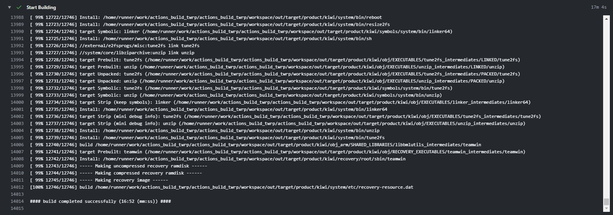

<h1 align="center"> 利用Github Actions编译TWRP</h1>

	

---

	A Github Action to build Recovery

	

 

由于编译时间较长，建议把<code>[.github/workflows/actions_twrp.yml](.github/workflows/actions_twrp.yml)</code>末尾上传处的`${{ secrets.GITHUB_TOKEN }}`改成自己的[Personal Access Token](https://github.com/settings/tokens)

注意保护自己的Personal Access Token，将它放入仓库[Settings](../../settings)里的[Secrets](../../settings/secrets)里后用`${{ secrets.YOUR_TOKEN_NAME }}`来替换`${{ secrets.GITHUB_TOKEN }}`

比如我的secret名字叫做work.则使用`${{ secrets.work }}`

## 配置

配置文件是[config.json](config.json)

| 名称               | 类型    | 描述                                                         |
| ------------------ | ------- | ------------------------------------------------------------ |
| `twrp_url`     | String  | Recovery Manifest地址                                        |
| `twrp_branch`  | String  | Recovery Manifest分支                                        |
| `git_username` | String  | 您使用Git的用户名                                            |
| `git_email`    | String  | 您使用Git的邮箱（Github可使用`Github ID+Github用户名@users.noreply.github.com`） |
| `use_own_dt`   | Boolean | 指示是否使用个人设备树此项为`true`后以下三项起效  |
| `dt_url`           | String  | 您使用的设备树的地址格式:USER/REPO                |
| `dt_branch`    | String  | 您使用的设备树的分支                                         |
| `dt_remote`        | String  | 您使用设备树的存储库如github/gitlab               |
| `dt_path`      | String  | 指示设备树本地保存位置示例device/huawei/kiwi      |
| `device_code`  | String  | 您将要编译机型的机型代号                                     |
| `fix_product`  | Boolean | 指示是否修复无法找到设备的问题                               |
| `fix_branch`       | String  | 指示修复以上问题所使用的分支                                 |
| `fix_misscom`  | Boolean | 指示是否修复缺少`device/qcom/common`的问题                   |
| `fix_busybox`      | Boolean | 指示是否修复缺少`busybox`的问题                              |

## 开始

Fork此仓库后，点击右上角Star就会开始

## 编译结果
可以在[Release](../../releases)下载
